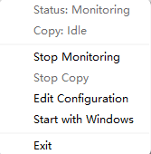
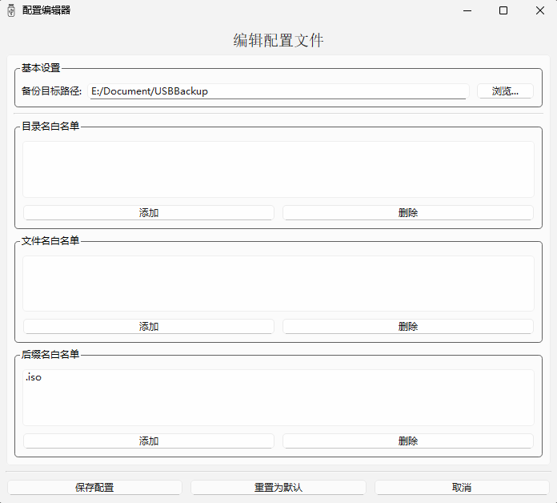

# PyUSBCopier
这是一款基于 Python 实现的 U盘 备份工具。

## 如何使用
> 目前仅支持 windows 系统，且仅在 win11 上进行过测试。如果需要其他平台支持，或者在使用过程中遇到问题，欢迎提交 issue。

从 [release](https://github.com/JesperY/PyUSBCopier/releases) 页面下载最新的 exe 文件，复制到任意目录下双击运行，成功启动会出现一个系统托盘图标，并在右下角弹窗提示。

## 托盘配置
在系统托盘图标上右键可以查看运行状态和调整一些简单配置。

* **Status**: 具有 `Monitoring` 和 `Stopped` 两种状态，由 `Stop/Start Monitoring` 控制，表示目前软件是否正在监控 USB 存储设备的变化。
* **Copy**: *此状态存在 Bug。*
* **Stop/Start Monitorsing**: 切换监控状态。
* **Stop/Start Copy**: 开始/停止复制操作。
* **Edit Configuration**: 编辑配置文件。
* **Start with Windows**: 切换是否随系统启动。
* **Exit**: 退出程序

## 配置文件

* **备份目标路径**: 选定备份的目标路径，所有的插入的 USB 存储设备会以 `deviceName_seriesNumber` 为根目录存储在该目标路径下。
* **目录名白名单**: 白名单的目录不会执行备份。
* **文件名白名单**: 白名单的文件不会执行备份。
* **后缀白名单那**: 以白名单的后缀结尾的文件不会执行备份。

**修改配置之后请不要忘记点击保存配置**
> 配置文件和日志文件默认存放在 `%APPDATA%\Roaming\USBBackup` 路径下，日志文件默认存放在 `%APPDATA%\local\USBBackup\Logs` 路径下。
## tips
本项目的灵感来自于 [USBCopyer](https://github.com/kenvix/USBCopyer)，这款使用 C# 实现的备份软件曾几次拯救我的数据于水火之中。但令人遗憾的是在我目前的主力机上这款软件一直在闪退而无法使用。
